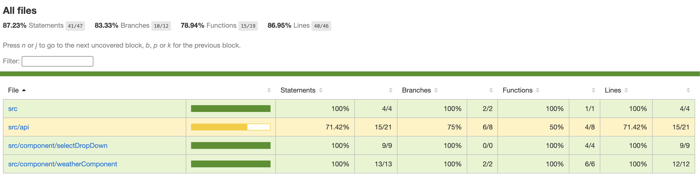

# Weather App

## Approach & How things are working internally

I have divided the app into two components: SelectDropdown and WeatherComponent. SelectDropdown contains a simple dropdown, and whenever a city is selected, we call the API to display the corresponding weather in WeatherComponent. Currently, we make two API calls, but we can optimize and make only one call since the forecast API also returns the weather of the present day.

### How to run this project

To start project: `npm start`
Then the project will be live on: [http://localhost:3000/weather-project](http://localhost:3000/weather-project)
To check coverage: `npm run test -- --coverage .`
To push the code live on github pages: `npm deploy`
To view the live project: [https://mohnish-sib.github.io/weather-project/](https://mohnish-sib.github.io/weather-project/)

### Why you choose this particular approach to solve this problem

I have chosen this approach because it is easy to comprehend, like two different components have separate purposes.Additionally, we can enhance this approach by implementing binary-search to locate the city in the cities array. Currently, we are iterating over the entire array to retrieve the complete object after selecting the city.

Code Coverage:

Lighthouse

